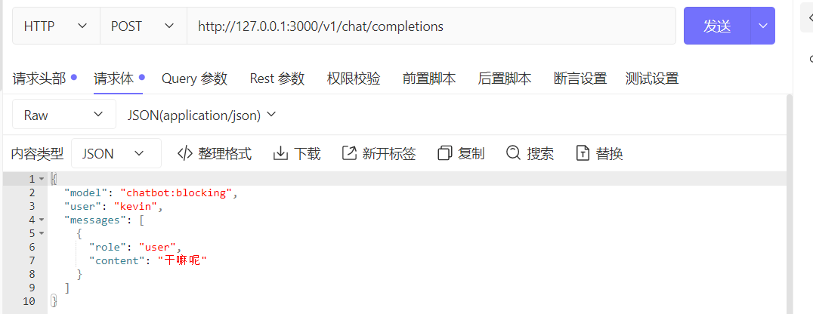
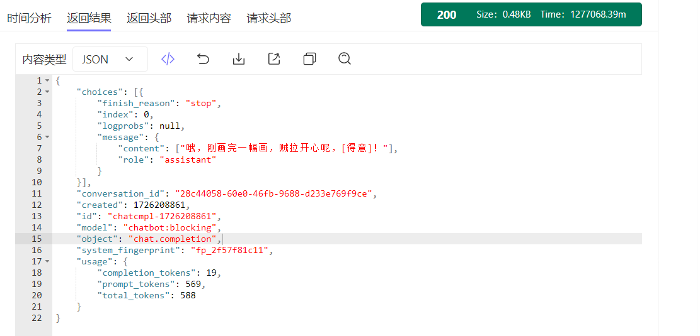
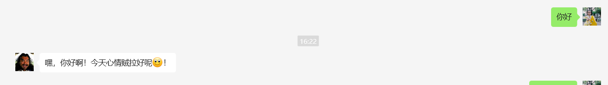

# 用户手册

## 情况
- dify.cn 
- dify.com
- do it for you!!!

## 前置条件
创建dify bot

# 项目

## 结构
```textyour_project/
├── Dockerfile
├── requirements.txt
├── run.py
└── app/
    ├── __init__.py
    └── other_module.py
```


## 环境变量
```text
   API_BASE=http(s)://xxxx/v1
```

## model

```text 
chatbot:blocking
目前只支持到 /chat-messages 接口类型的bot(chatbot,agent,chatflow)
```

### 调试



content是list,元素有可能是多个图片链接，多个内容。使用时注意下。

##  效果
### dify of wechat

# 部署
## 本地启动
```base 
    python run.py
```
## docker
docker build -t dify2openai:latest .
```bash
docker run --name dify2openai --restart=always -d -p 3000:3000 -e API_BASE={{API_BASE}}  dify2openai:latest
```


